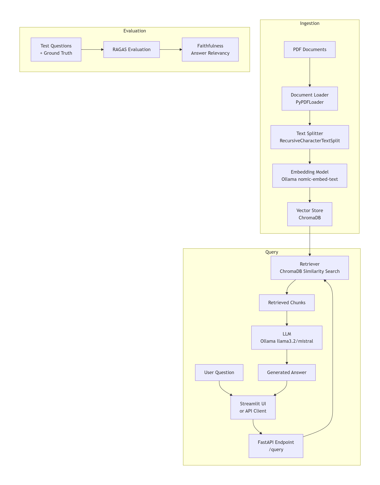

# RAG Knowledge Assistant

A Retrieval-Augmented Generation (RAG) system that answers questions over financial documents (e.g., SEC 10-K filings) using open-source LLMs and vector search.

## Architecture

  

The system is divided into three main phases:

- **Ingestion Pipeline** 
    PDF documents are loaded using PyPDFLoader.
    Text is split into overlapping chunks with RecursiveCharacterTextSplitter.
    Each chunk is converted into a vector embedding using Ollama's nomic-embed-text.
    Vectors and metadata are stored in ChromaDB (local persistence).
-**Query Interface**
    User submits a question via Streamlit UI or direct HTTP request to FastAPI.
    FastAPI uses the retriever to fetch top‑k relevant chunks from ChromaDB.
    The question and retrieved chunks are passed to an Ollama LLM (e.g., llama3.2) to generate a final answer.
    Answer and source references are returned to the client.
-**Evaluation**
    A separate script uses RAGAS to measure faithfulness and answer relevance on a set of predefined questions with ground truth answers.
    This helps assess system performance and guides improvements.

The system consists of:
-**Ingestion Pipeline**: Load PDFs, chunk text, generate embeddings with Ollama (nomic-embed-text), store in ChromaDB.
-**Query Interface**: FastAPI backend and Streamlit UI that accepts a question, retrieves relevant chunks, and generates an answer using Ollama LLM.
-**Evaluation**: RAGAS metrics (faithfulness, answer relevance) to assess performance.

## Tech Stack 
- **Python 3.10+**
- **LangChain** – orchestration
- **ChromaDB** – vector store
- **Ollama** – embeddings (`nomic-embed-text`) and LLM (`llama3.2` or `mistral`)
- **FastAPI** – API
- **Streamlit** – UI
- **RAGAS** – evaluation

## Setup

1. **Clone the repository**
   ```bash
   git clone https://github.com/your-username/rag-knowledge-assistant.git
   cd rag-knowledge-assistant